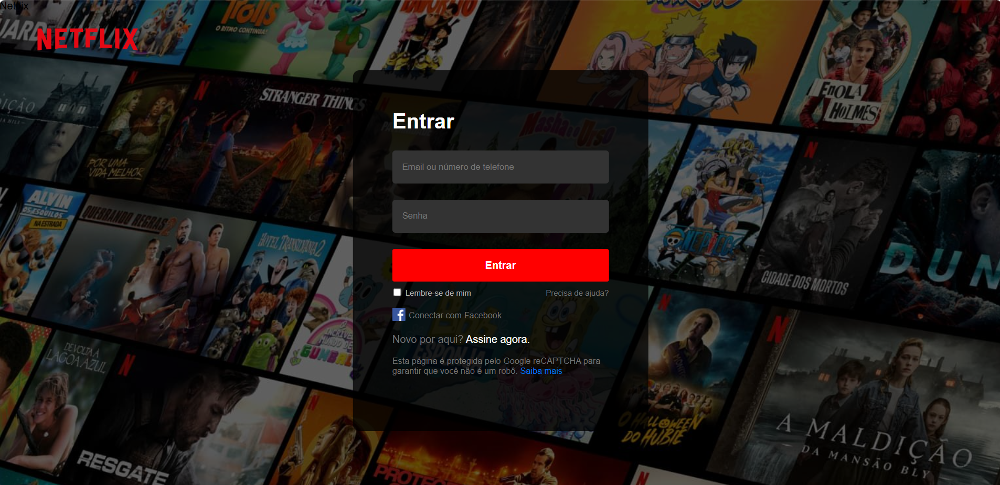

### Clone da Página de Login da Netflix

Este projeto foi criado como parte de um desafio, com o objetivo de reproduzir a página de login da Netflix **usando apenas HTML e CSS**, replicando fielmente a interface original.

## Funcionalidades:
- Layout responsivo que replica a interface de login da Netflix
- Uso de HTML semântico e CSS para estilização
- Nenhum framework ou biblioteca externa foi utilizado, tornando-o leve e fácil de entender.

 

> Objetivo:
O objetivo deste projeto é treinar habilidades de front-end, focando em HTML e CSS.

 

Se tiver alguma dúvida ou sugestão, fique à vontade para abrir uma issue ou contribuir diretamente!

______________________

### Netflix Login Page Clone

This project was created as part of a challenge, aiming to replicate the Netflix login page **using only HTML and CSS**, faithfully reproducing the original interface.

## Features:
- Responsive layout that replicates the Netflix login interface
- Use of semantic HTML and CSS for styling
- No external frameworks or libraries were used, making it lightweight and easy to understand.

 

> Objective:
The goal of this project is to practice front-end skills, focusing on HTML and CSS.

 

If you have any questions or suggestions, feel free to open an issue or contribute directly!

